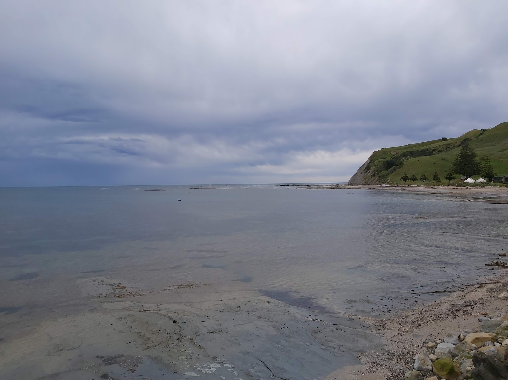

<link rel="stylesheet" href="styles.css" />


Use the map below to scroll through the area of Gisborne!
The map is interactive.


<center>

</center>


```{r echo=FALSE, warning=FALSE, fig.height=4, fig.width=10, cache=TRUE , fig.cap="Christchurch map"}
library(leaflet)
library(knitr)

m <- leaflet() %>% addTiles() %>% setView(178.022445, -38.672033, zoom = 12)
m  #  -38.672033, 178.022445


opts_chunk$set(comment="", fig.align="center", tidy=TRUE)
knitr::opts_chunk$set(warning = FALSE, message = FALSE)
```