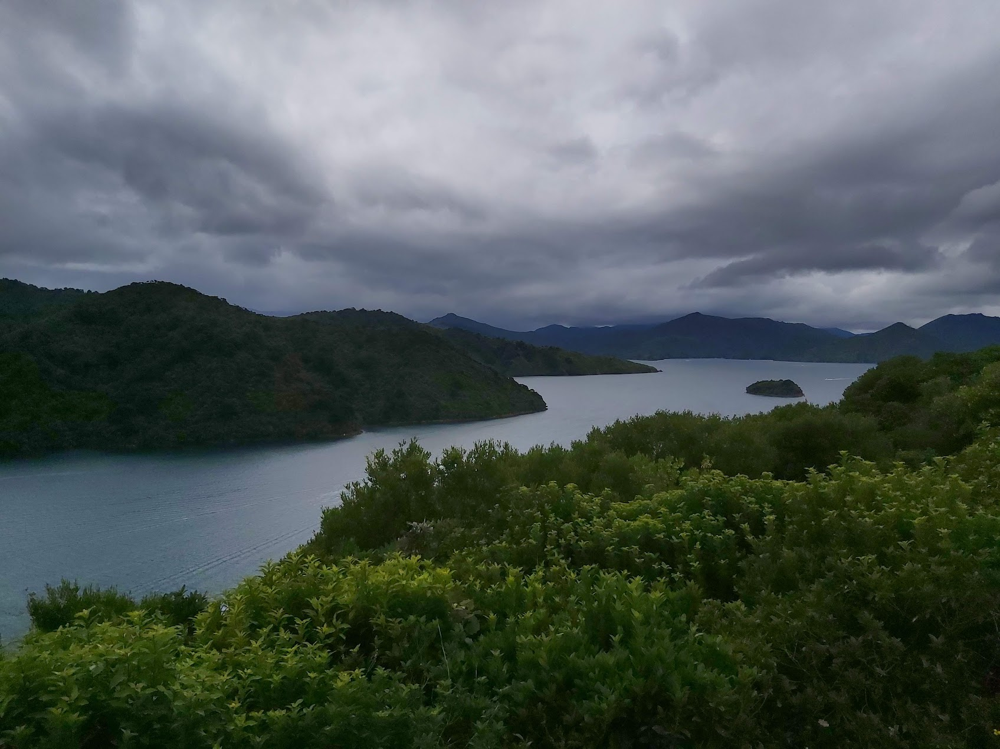

<link rel="stylesheet" href="styles.css" />
<br></br>
<div><h3><center>
Nelson was a really cool trip, we had quite a lot of driving, and the hills were quite treacherous, but as always it was worth it!
</div></h3></center>

<p>
Use the map below to scroll around Nelson, we went to Motueka where we stayed a few nights, had some great walks, and there was also a really nice restaurant that we went to!

We were also at Able Tasman for some walking and awesome site seeing!

</p>


```{r echo=FALSE, warning=FALSE, fig.height=5, fig.width=14, cache=TRUE , fig.cap="Nelson map"}
library(leaflet)
library(knitr)

m <- leaflet() %>% addTiles() %>% setView(173.265414, -41.267588, zoom = 13)
m  #  -41.267588, 173.265414


opts_chunk$set(comment="", fig.align="center", tidy=TRUE)
knitr::opts_chunk$set(warning = FALSE, message = FALSE)
```

<p><b>
Use the map below to scroll through the area of Nelson!
The map is interactive.
</p></b>

<center>

</center>