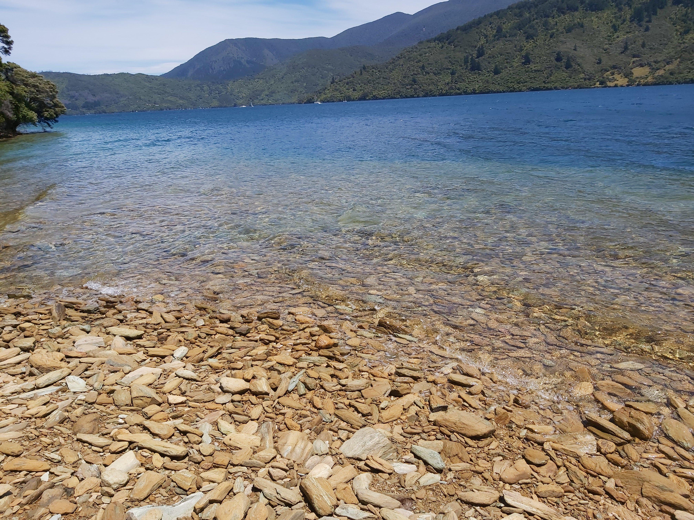

<link rel="stylesheet" href="styles.css" />
<br></br>

<style>

.pictonpics{

display: flex;
flex-direction: column;
justify-content: space-between;

}


</style>


<body>

<div>
<h3>
<center>
Picton was a real supprise to us. It is very beautiful, small but it had everything!

We were here over a new year's eve, and had some amazing fireworks in the bay.
</center>
</h3>
</div>


<p>
Use the map below to scroll through the area of Picton!
</p>


```{r echo=FALSE, warning=FALSE, fig.height=5, fig.width=14, cache=TRUE , fig.cap="Picton map"}
library(leaflet)
library(knitr)

m <- leaflet() %>% addTiles() %>% setView(174.006452, -41.288479, zoom = 18)
m  #  -41.288479, 174.006452

opts_chunk$set(comment="", fig.align="center", tidy=TRUE)
knitr::opts_chunk$set(warning = FALSE, message = FALSE)
```
<div class="pictonpics">


.jpg)




</div>


</body>

