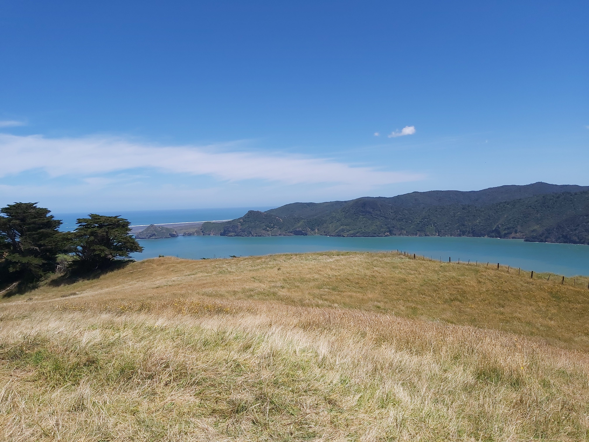
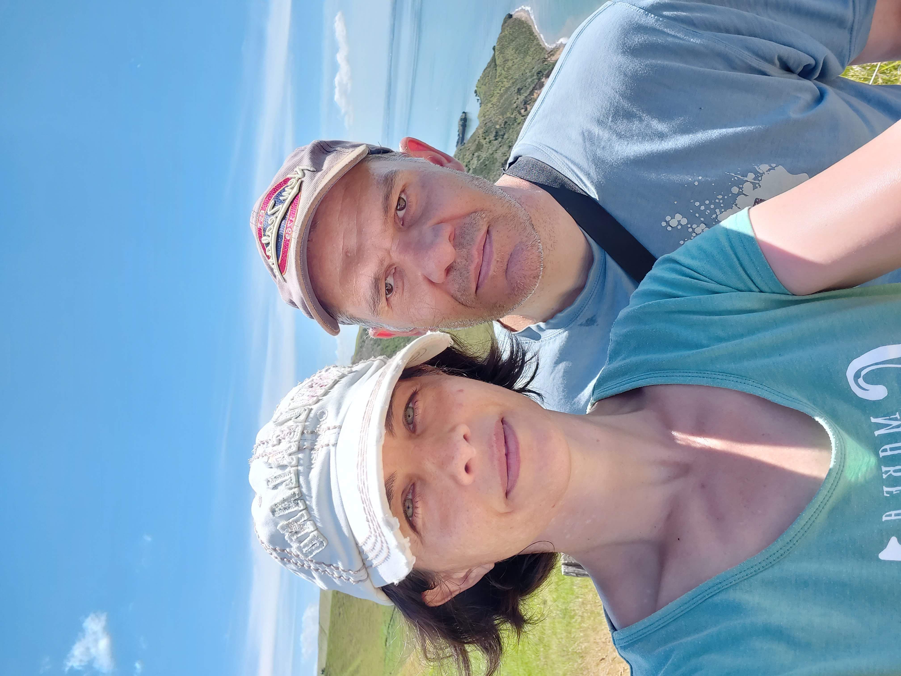
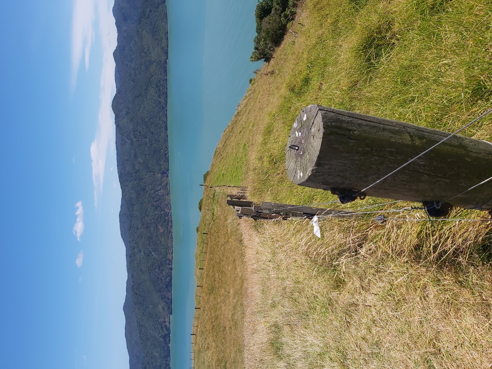
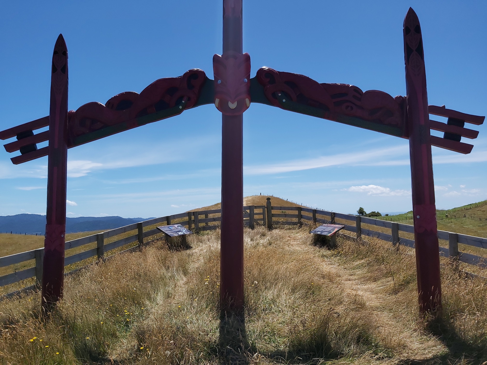
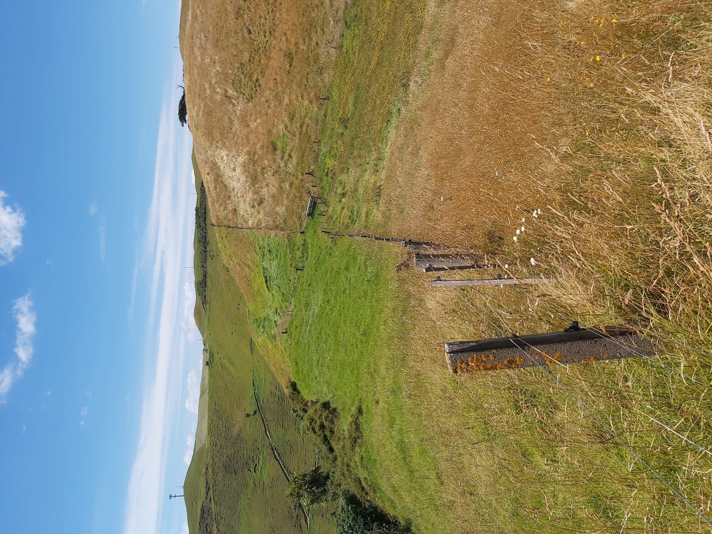
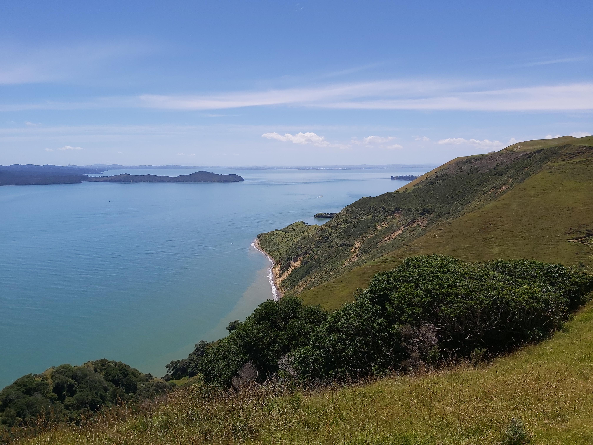

  <meta charset="utf-8">
  <meta name="viewport" content="width=device-width, initial-scale=1">
  <link rel="stylesheet" href="https://maxcdn.bootstrapcdn.com/bootstrap/3.4.1/css/bootstrap.min.css">
  <script src="https://ajax.googleapis.com/ajax/libs/jquery/3.7.1/jquery.min.js"></script>
  <script src="https://maxcdn.bootstrapcdn.com/bootstrap/3.4.1/js/bootstrap.min.js"></script>
  
  <link rel="stylesheet" href="styles.css" />
<br></br>

<p>
The Manakau heads, very pretty, beautiful views and some Mauri culture!
</p>


<p><b>
Use the map below to scroll around! There is a channel between the 2 peices of land, the manukau heads and whatipu.

Drag the map around a bit to get a feel.
</p></b>

<style>

.headspics{

display: flex;
flex-direction: column;
flex-wrap: wrap; 
gap: 20px;

}

.tgc{
position: relative;
bottom:0 px;
}

.pic { 
display: flex; 
flex-direction: column;  
align-items: center;  
text-align: center; 
}


.pic img { 
margin-bottom: 10px;  
}

</style>


```{r echo=FALSE, warning=FALSE, fig.height=5, fig.width=14, cache=TRUE , fig.cap="whatipu map"}
library(leaflet)
library(knitr)

m <- leaflet() %>% addTiles() %>% setView(174.544879, -37.047250, zoom = 13)
m  #  -37.047250, 174.544879


opts_chunk$set(comment="", fig.align="center", tidy=TRUE)
knitr::opts_chunk$set(warning = FALSE, message = FALSE)
```

<p>
The Manakau heads!
</p>


<div class="headspics">



















</div>

<br></br>

<hr></hr>

<div id="tgc">


[back to tag cloud](https://nicspics.netlify.app/tags/random/)

</div>
