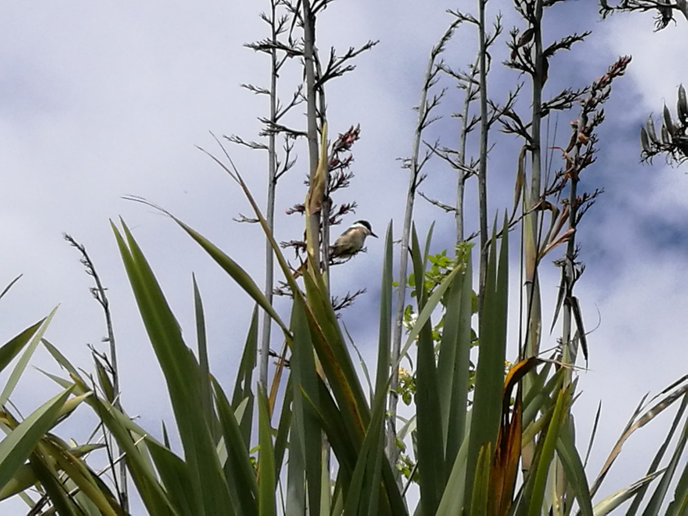
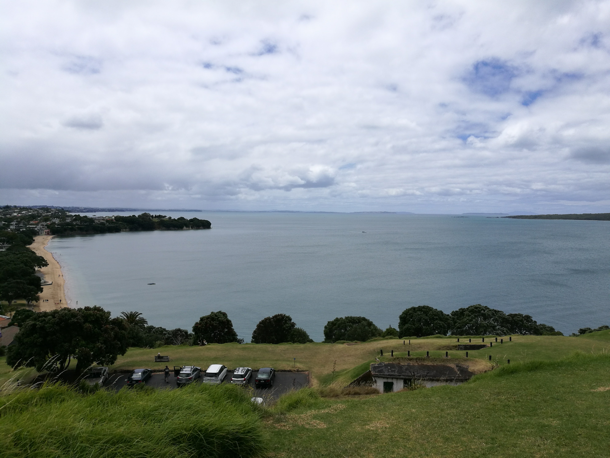

<link href="index_files/htmltools-fill/fill.css" rel="stylesheet" />

<link href="index_files/leaflet/leaflet.css" rel="stylesheet" />

<link href="index_files/leafletfix/leafletfix.css" rel="stylesheet" />

<link href="index_files/rstudio_leaflet/rstudio_leaflet.css" rel="stylesheet" />

<meta charset="utf-8">
<meta name="viewport" content="width=device-width, initial-scale=1">
<link rel="stylesheet" href="https://maxcdn.bootstrapcdn.com/bootstrap/3.4.1/css/bootstrap.min.css">

<link rel="stylesheet" href="styles.css" />
  

North head is very close to auckland CBD but to get there by car takes some time due to the traffic being so congested!
A lot of people will simply catch a ferry across the bay to get to Auckland CBD. There is a dedicated ferry service from Devon Port which is basically where North head is situated.

<b>
Use the map below to scroll through the area of North head, see how close it is to Auckland CBD!
The map is interactive.

</b>

Figure 1: North head map

Some of the awesome photos we took here! If you download any of these photos, they’ll download the original photo taken.

  

[back to tag cloud](https://nicspics.netlify.app/tags/random/)

