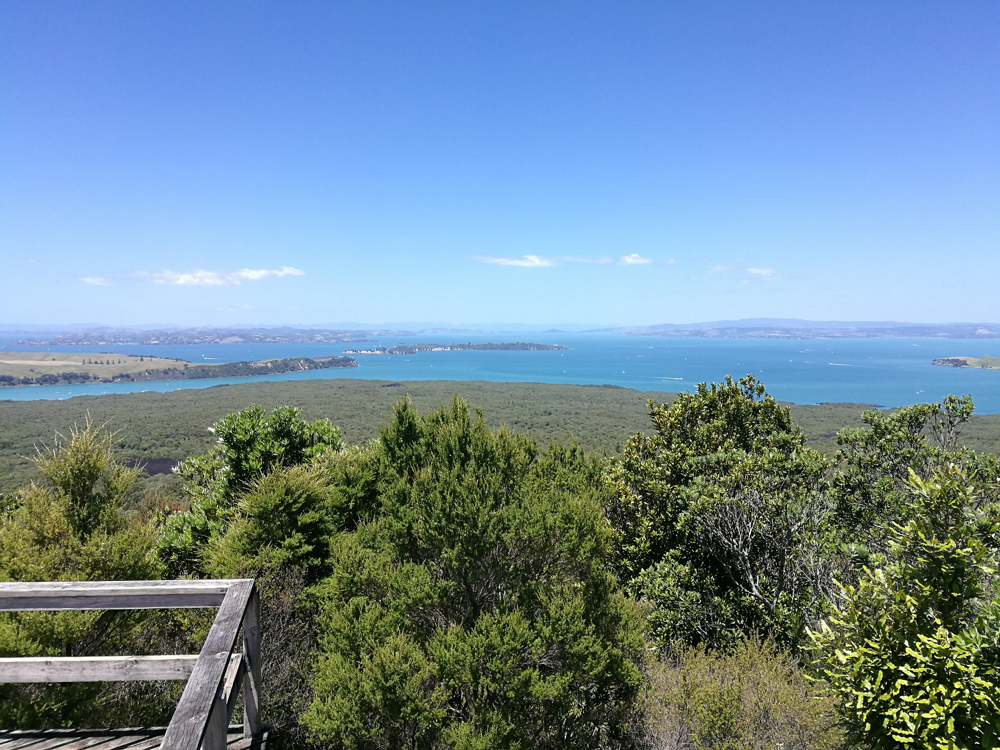

  <meta charset="utf-8">
  <meta name="viewport" content="width=device-width, initial-scale=1">
  <link rel="stylesheet" href="https://maxcdn.bootstrapcdn.com/bootstrap/3.4.1/css/bootstrap.min.css">
  <script src="https://ajax.googleapis.com/ajax/libs/jquery/3.7.1/jquery.min.js"></script>
  <script src="https://maxcdn.bootstrapcdn.com/bootstrap/3.4.1/js/bootstrap.min.js"></script>
  
  <link rel="stylesheet" href="styles.css" />
<br></br>

<p>
rangitoto island is originally a volcano which emerged from the sea several centuries ago, about 600 years. We've been there a few times, and the black rocks are probably lava rocks!

A pretty decent walk!
</p>


<p><b>
Use the map below to explore some of this island and it's surrounds! 

</p></b>

<style>

.rangitotopics{

display: flex;
flex-direction: column;
justify-content: space-between;

}

.tgc{
position: relative;
bottom:0 px;
}


</style>


```{r echo=FALSE, warning=FALSE, fig.height=5, fig.width=14, cache=TRUE , fig.cap="rangitoto island map"}
library(leaflet)
library(knitr)

m <- leaflet() %>% addTiles() %>% setView(174.862072, -36.808045, zoom = 13)
m  #  -36.808045, 174.862072


opts_chunk$set(comment="", fig.align="center", tidy=TRUE)
knitr::opts_chunk$set(warning = FALSE, message = FALSE)
```

<p>
We've walked to summit, and its pretty awesome!
</p>
<p>
The island is a pest free island.
</p>


<div class="rangitotopics">





<div id="six">

<p><b>   A bee on Jo's hat! </b></p>
</div>

<div id="one">

<p><b>   The black rocks!</b> </p>
</div>


<div id="two">

<p><b>   That island in the back is Motutapu island, I've been there before and it's very pretty but I went there on a volunteer day with my work. We had to do weeding and heavy labour. I've wanted to go back there with Jo (not to work, but to explore!), but its not easy to get a ferry to the island, and for 2 people it would be very expensive.</b> </p>
</div

</div>

</div>

<br></br>

<hr></hr>

<div id="tgc">


[back to tag cloud](https://nicspics.netlify.app/tags/random/)

</div>

