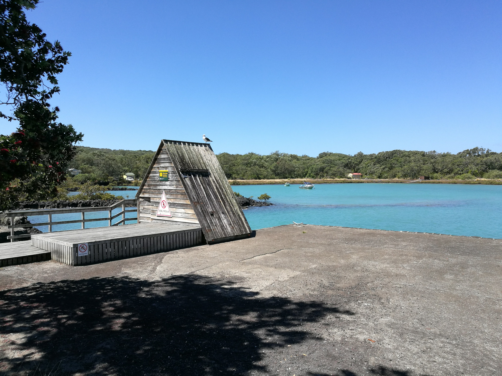
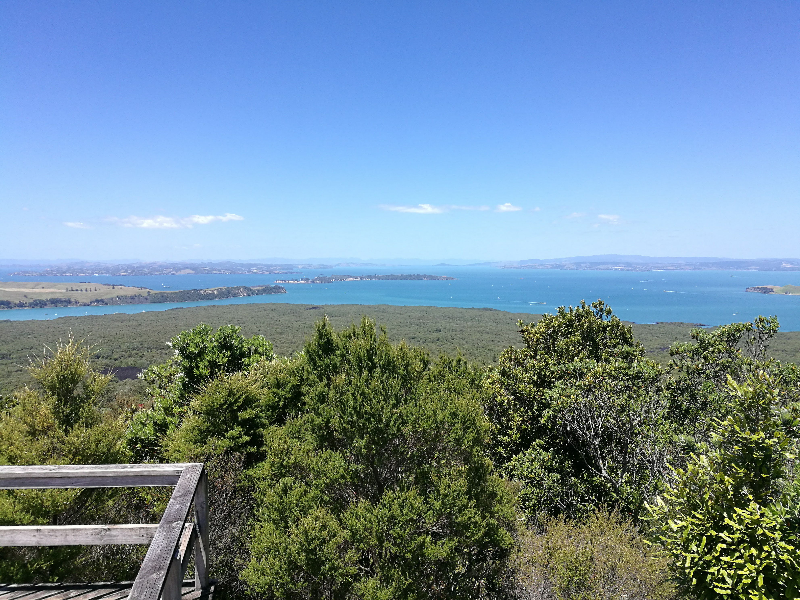
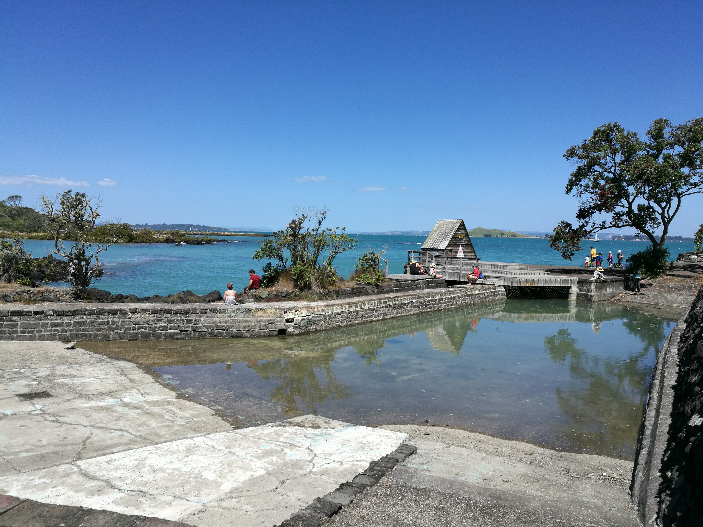
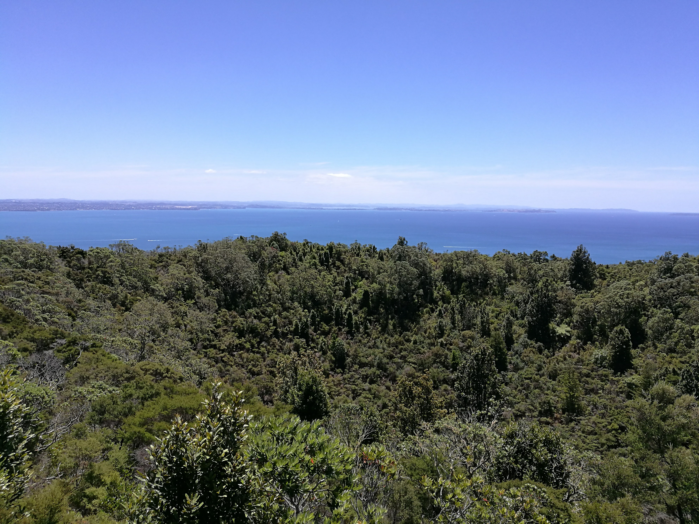
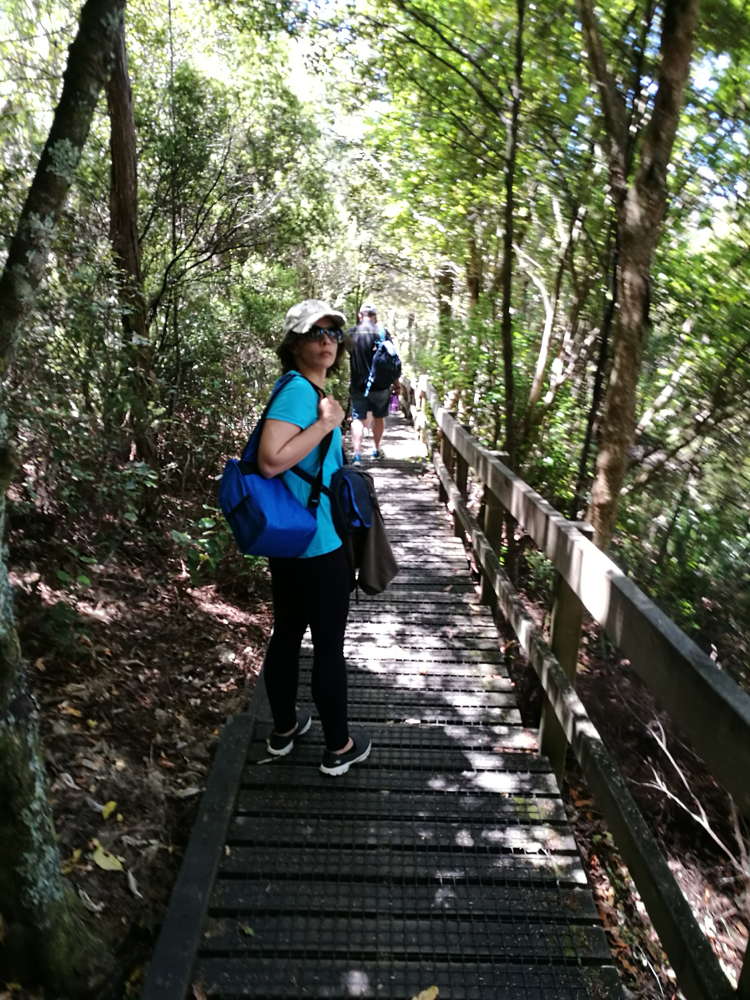
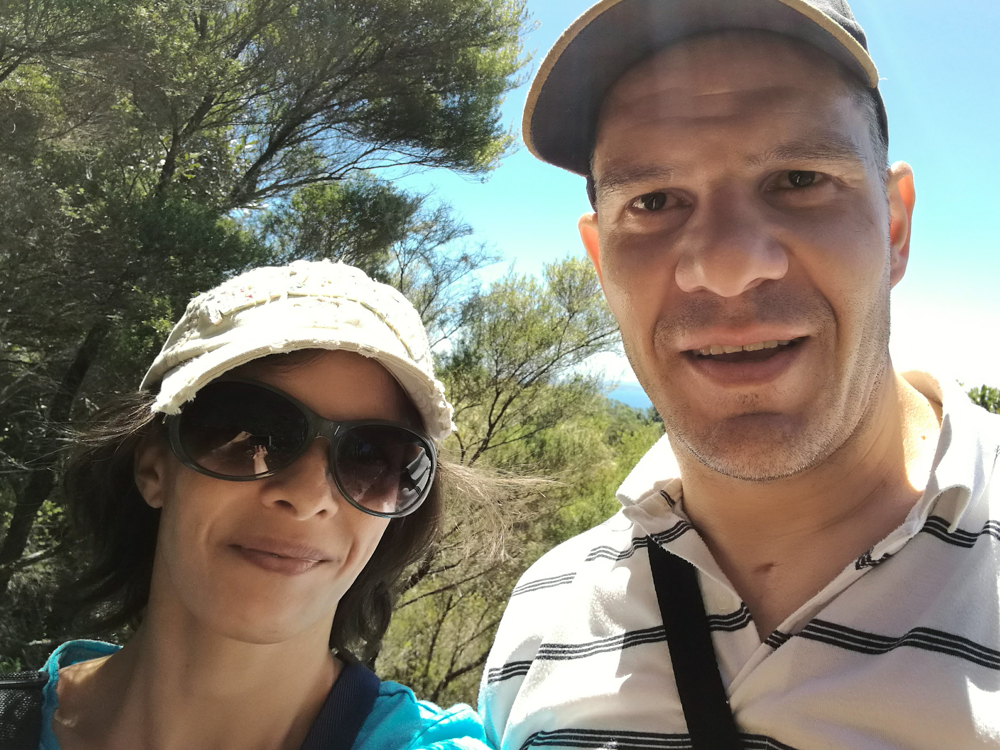
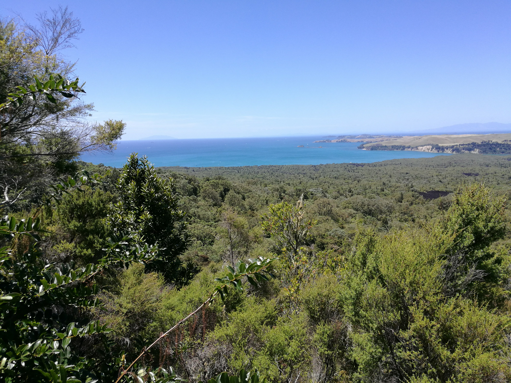

<link href="index_files/htmltools-fill/fill.css" rel="stylesheet" />

<link href="index_files/leaflet/leaflet.css" rel="stylesheet" />

<link href="index_files/leafletfix/leafletfix.css" rel="stylesheet" />

<link href="index_files/rstudio_leaflet/rstudio_leaflet.css" rel="stylesheet" />

<meta charset="utf-8">
<meta name="viewport" content="width=device-width, initial-scale=1">
<link rel="stylesheet" href="https://maxcdn.bootstrapcdn.com/bootstrap/3.4.1/css/bootstrap.min.css">

<link rel="stylesheet" href="styles.css" />
  

rangitoto island is a volcano which emerged from the sea several centuries ago, about 600 years. We’ve been there a few times, and the black rocks are probably lava rocks!
I assume that the volcano is dormant!

<b>
Use the map below to explore some of this island and it’s surrounds!

</b>

Figure 1: rangitoto island map

We’ve walked to the summit, and its a pretty awesome walk and view!
The island is a pest free island.

<b> Our arrival</b>

That island in the back is Motutapu island, I’ve been there before and it’s very pretty but I went there on a volunteer day with my work. I’ve wanted to go back there with Jo , but it’s not easy to get a ferry to the island, and for 2 people it would be very expensive as the charter would have to make the trip just for us.

  

[back to tag cloud](https://nicspics.netlify.app/tags/random/)

