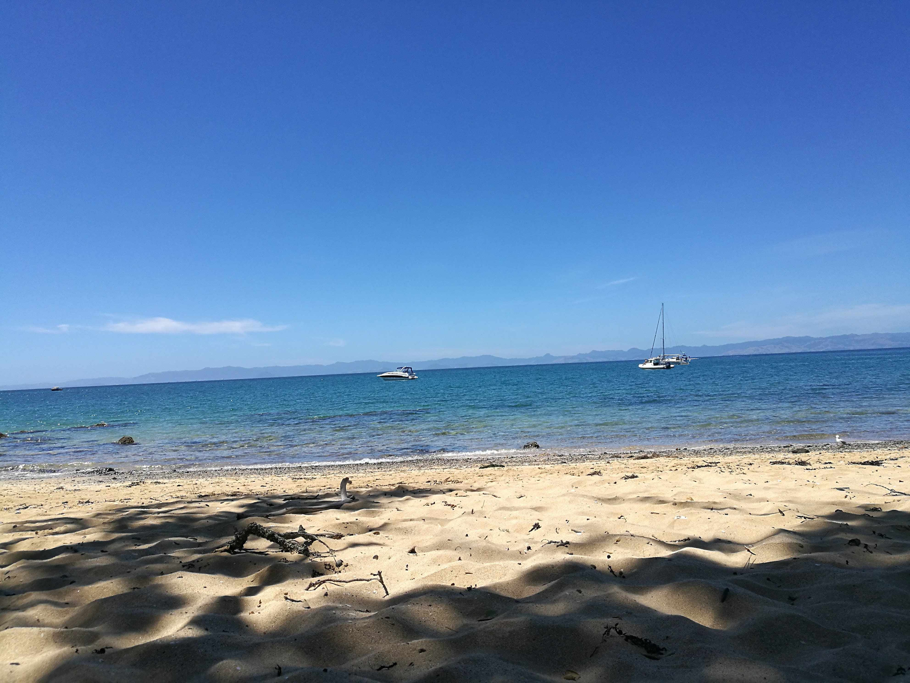
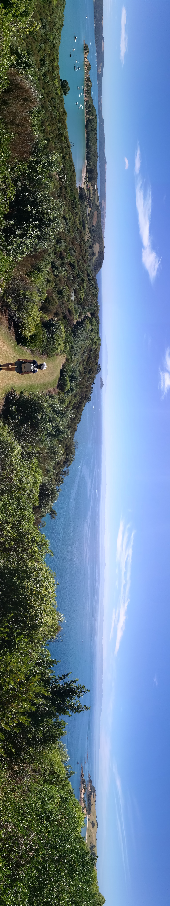

  <meta charset="utf-8">
  <meta name="viewport" content="width=device-width, initial-scale=1">
  <link rel="stylesheet" href="https://maxcdn.bootstrapcdn.com/bootstrap/3.4.1/css/bootstrap.min.css">
  <script src="https://ajax.googleapis.com/ajax/libs/jquery/3.7.1/jquery.min.js"></script>
  <script src="https://maxcdn.bootstrapcdn.com/bootstrap/3.4.1/js/bootstrap.min.js"></script>
<br></br>

<p>
Rotorua island, somewhere in the Hauraki gulf!
</p>


<p><b>
Use the map below to scroll through the area of Rotorua island!
The map is interactive.
</p></b>

<style>

.rotoruaislandpics{


display: flex;
flex-direction: column;
justify-content: space-between;

}

</style>


```{r echo=FALSE, warning=FALSE, fig.height=5, fig.width=14, cache=TRUE , fig.cap="rotorua island map"}
library(leaflet)
library(knitr)

m <- leaflet() %>% addTiles() %>% setView(175.194535, -36.816917, zoom = 15)
m  #  -36.816917, 175.194535


opts_chunk$set(comment="", fig.align="center", tidy=TRUE)
knitr::opts_chunk$set(warning = FALSE, message = FALSE)
```

<p>
This is a pretty special place, another island sanctuary for birds. We took a quick ferry ride from downtown Auckland!
</p>


<div class="rotoruaislandpics">







</div>