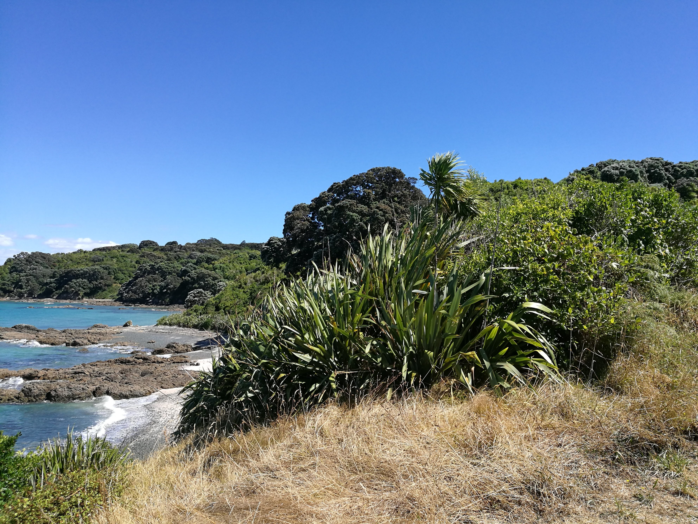
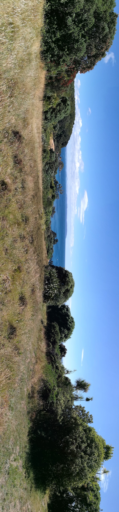
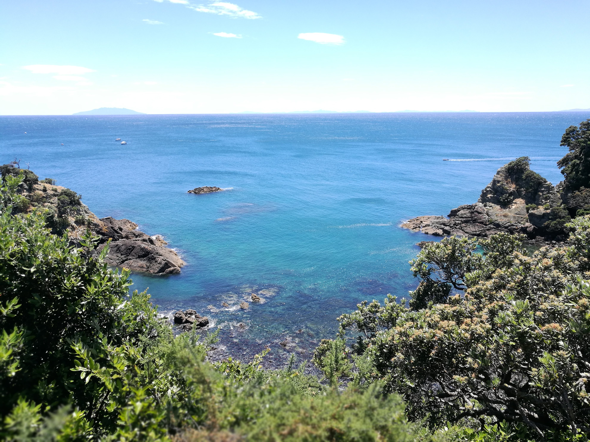

  <meta charset="utf-8">
  <meta name="viewport" content="width=device-width, initial-scale=1">
  <link rel="stylesheet" href="https://maxcdn.bootstrapcdn.com/bootstrap/3.4.1/css/bootstrap.min.css">
  <script src="https://ajax.googleapis.com/ajax/libs/jquery/3.7.1/jquery.min.js"></script>
  <script src="https://maxcdn.bootstrapcdn.com/bootstrap/3.4.1/js/bootstrap.min.js"></script>
  
  <link rel="stylesheet" href="styles.css" />
<br></br>

<p>
Tiritiri Matangi island is an island sanctuary with some pretty rare birds
</p>


<p><b>
Use the map below to scroll through the area of Tiritiri Matangi Island!
The map is interactive.
</p></b>

<style>

.tiripics{

display: flex;
flex-direction: column;
justify-content: space-between;

}

.tgc{
position: relative;
bottom:0 px;
}

</style>


```{r echo=FALSE, warning=FALSE, fig.height=5, fig.width=14, cache=TRUE , fig.cap="Tiritiri matangi island map"}
library(leaflet)
library(knitr)

m <- leaflet() %>% addTiles() %>% setView(174.888270, -36.604910, zoom = 15)
m  #  -36.604910, 174.888270


opts_chunk$set(comment="", fig.align="center", tidy=TRUE)
knitr::opts_chunk$set(warning = FALSE, message = FALSE)
```

<p>
Some of the awesome photos we took here! If you download any of these photos, they'll download the original photo taken.
</p>


<div class="tiripics">


 











</div>

<br></br>

<hr></hr>

<div id="tgc">


[back to tag cloud](https://nicspics.netlify.app/tags/random/)

</div>


