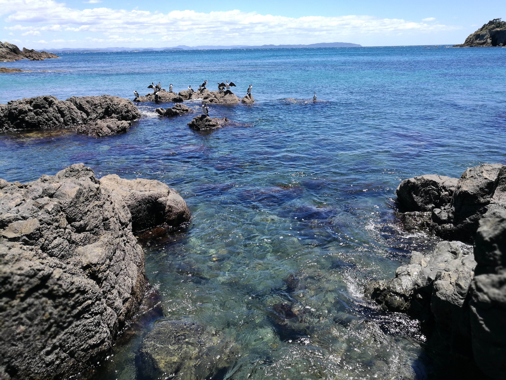

<link rel="stylesheet" href="styles.css" />
<br></br>

<p>
Tiritiri Matangi island is an island sanctuary with some pretty rare birds
</p>


<p><b>
Use the map below to scroll through the area of Tiritiri Matangi Island!
The map is interactive.
</p></b>


```{r echo=FALSE, warning=FALSE, fig.height=5, fig.width=14, cache=TRUE , fig.cap="Tiritiri matangi island map"}
library(leaflet)
library(knitr)

m <- leaflet() %>% addTiles() %>% setView(174.888270, -36.604910, zoom = 15)
m  #  -36.604910, 174.888270


opts_chunk$set(comment="", fig.align="center", tidy=TRUE)
knitr::opts_chunk$set(warning = FALSE, message = FALSE)
```


<center>

</center>

{width=400px height=800px}

{width=600px height=600px}