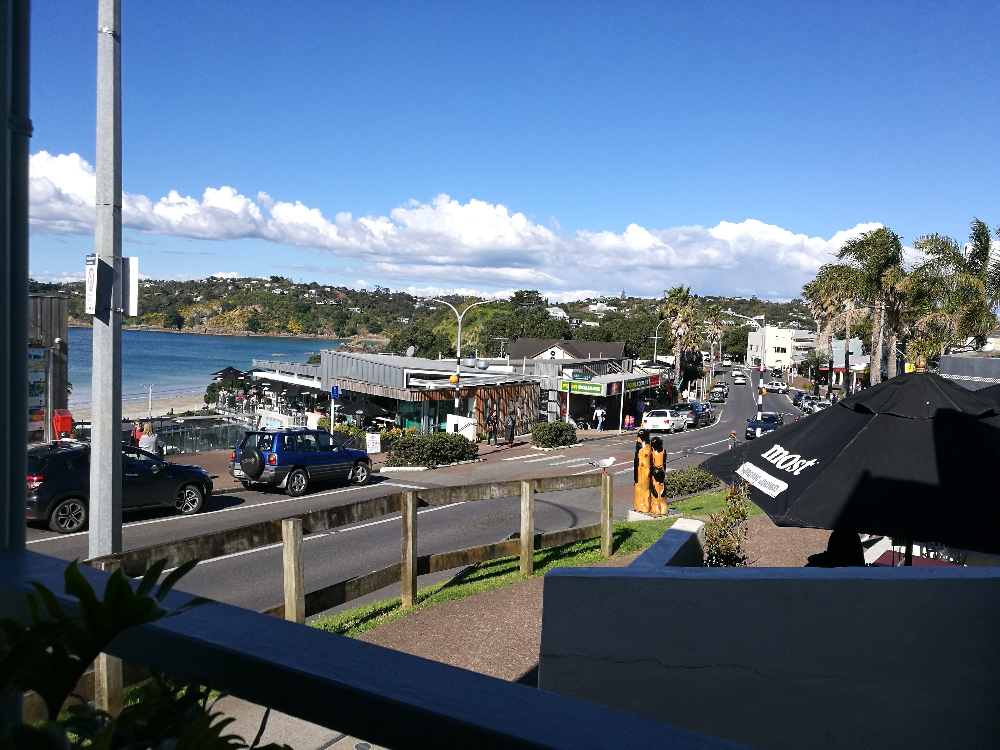
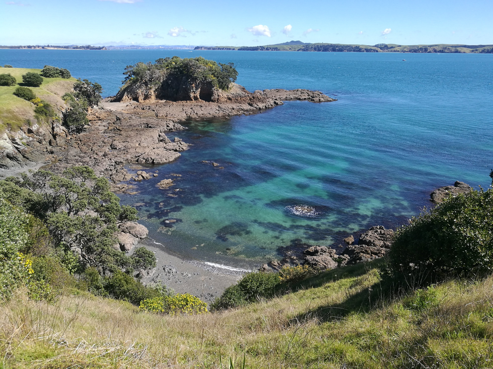
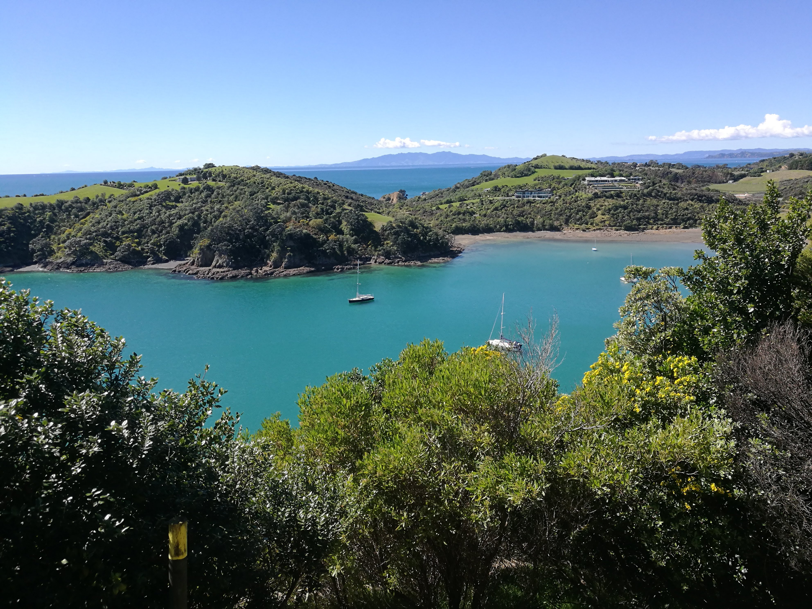
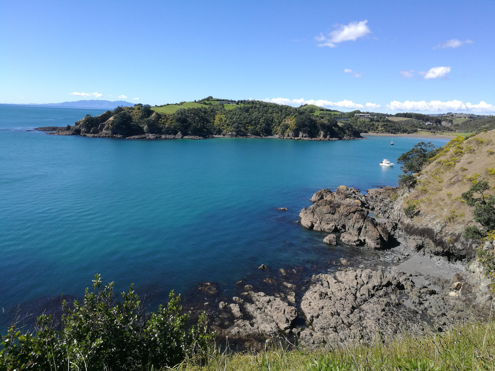
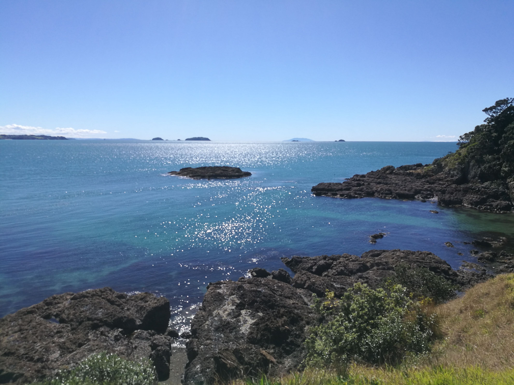

  <meta charset="utf-8">
  <meta name="viewport" content="width=device-width, initial-scale=1">
  <link rel="stylesheet" href="https://maxcdn.bootstrapcdn.com/bootstrap/3.4.1/css/bootstrap.min.css">
  <script src="https://ajax.googleapis.com/ajax/libs/jquery/3.7.1/jquery.min.js"></script>
  <script src="https://maxcdn.bootstrapcdn.com/bootstrap/3.4.1/js/bootstrap.min.js"></script>
  
  <link rel="stylesheet" href="styles.css" />
<br></br>

<p>
Waiheke island is one of the larger islands close to Auckland , and accessible by ferry.

There are some great walks on Waiheke!
</p>


<p><b>
Use the map below to explore some of this beautiful island! 

</p></b>

<style>

.waihekepics{

display: flex;
flex-direction: column;
justify-content: space-between;

}

.tgc{
position: relative;
bottom:0 px;
}


</style>


```{r echo=FALSE, warning=FALSE, fig.height=5, fig.width=14, cache=TRUE , fig.cap="waiheke island map"}
library(leaflet)
library(knitr)

m <- leaflet() %>% addTiles() %>% setView(175.032221, -36.804137, zoom = 13)
m  #  -36.804137, 175.032221


opts_chunk$set(comment="", fig.align="center", tidy=TRUE)
knitr::opts_chunk$set(warning = FALSE, message = FALSE)
```

<p>
As you can see there are many islands in the Hauraki gulf!
</p>
<p>
It turns out that the water on waiheke isn't from the mainland (Auckland), but it's actually tank water collected from rain. There is a library there too!
</p>


<div class="waihekepics">
















</div>

</div>

<br></br>

<hr></hr>

<div id="tgc">


[back to tag cloud](https://nicspics.netlify.app/tags/random/)

</div>

