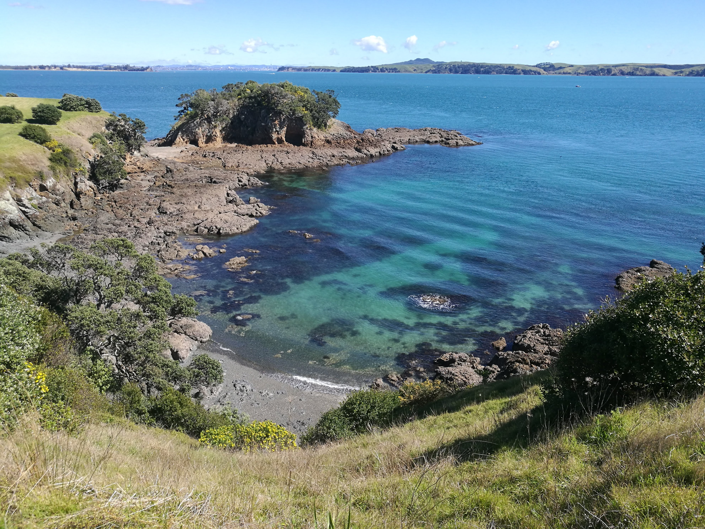
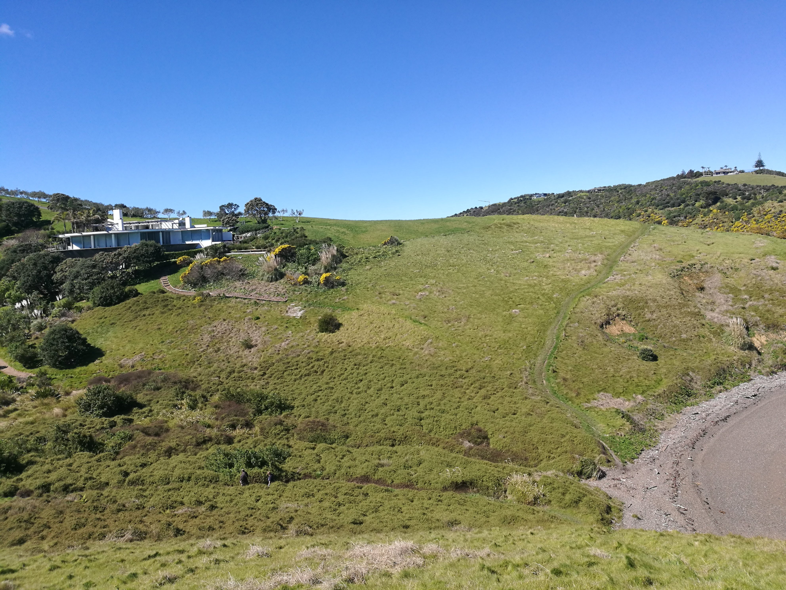

<link href="index_files/htmltools-fill/fill.css" rel="stylesheet" />

<link href="index_files/leaflet/leaflet.css" rel="stylesheet" />

<link href="index_files/leafletfix/leafletfix.css" rel="stylesheet" />

<link href="index_files/rstudio_leaflet/rstudio_leaflet.css" rel="stylesheet" />

<meta charset="utf-8">
<meta name="viewport" content="width=device-width, initial-scale=1">
<link rel="stylesheet" href="https://maxcdn.bootstrapcdn.com/bootstrap/3.4.1/css/bootstrap.min.css">

<link rel="stylesheet" href="styles.css" />
  

Waiheke island is one of the larger islands close to Auckland , and accessible by ferry.

There are some great walks on Waiheke!

<b>
Use the map below to explore some of this beautiful island!

</b>

Figure 1: waiheke island map

As you can see there are many islands in the Hauraki gulf!

It turns out that the water on waiheke isn’t from the mainland (Auckland), but it’s actually tank water collected from rain.
There is a library there too!

  

[back to tag cloud](https://nicspics.netlify.app/tags/random/)

