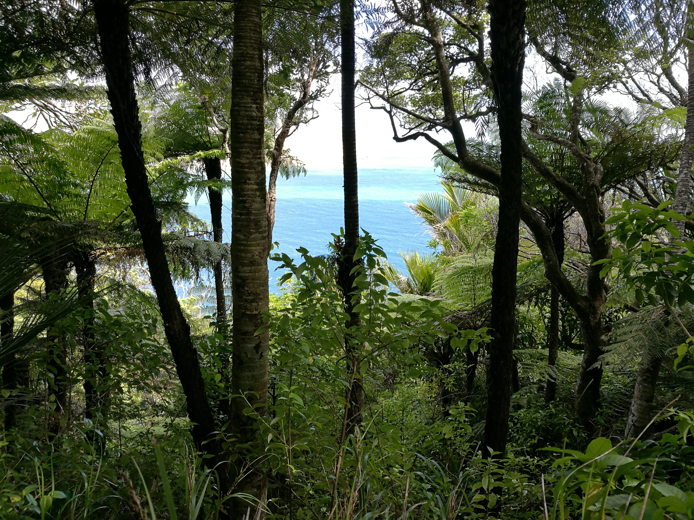
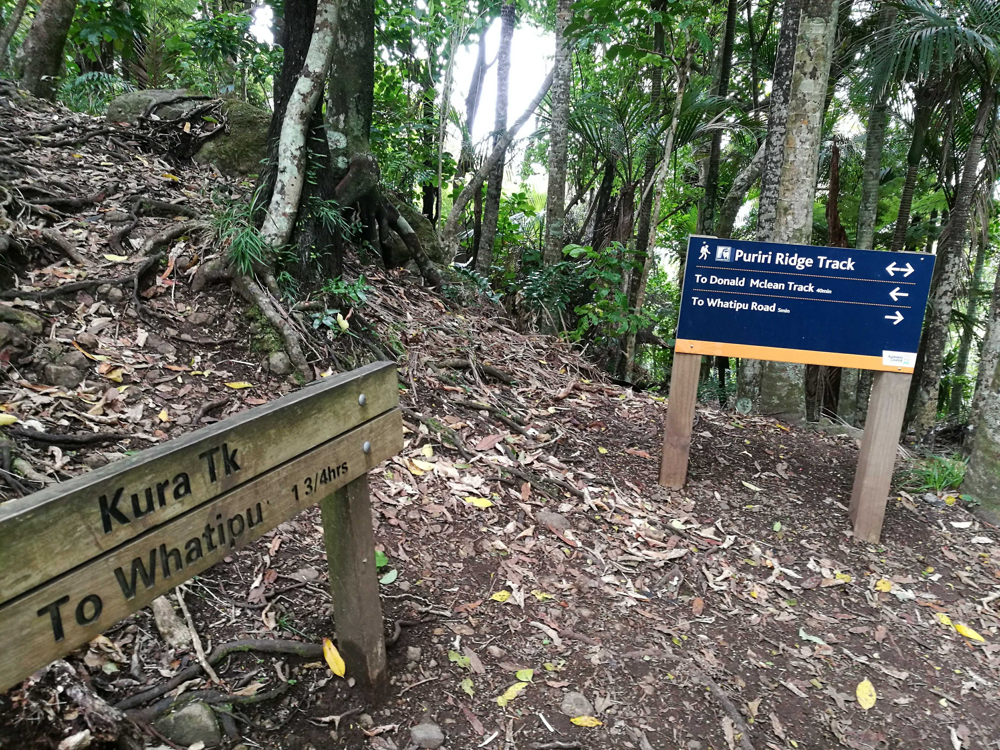
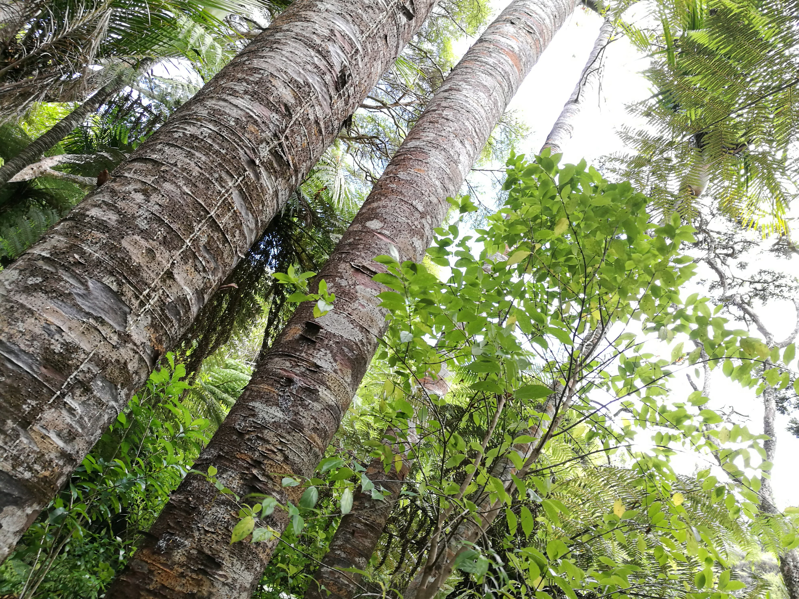
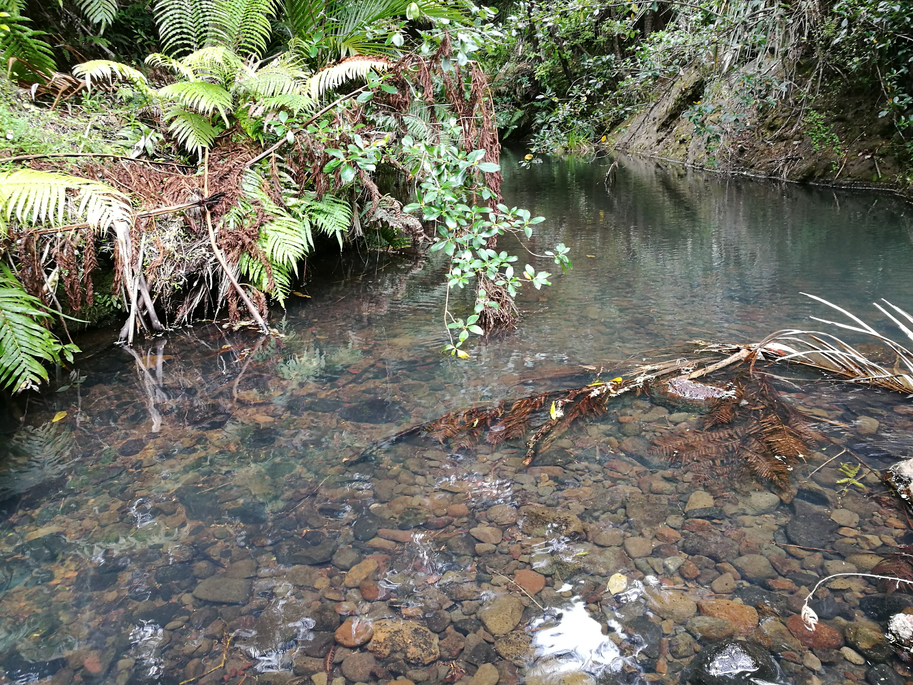
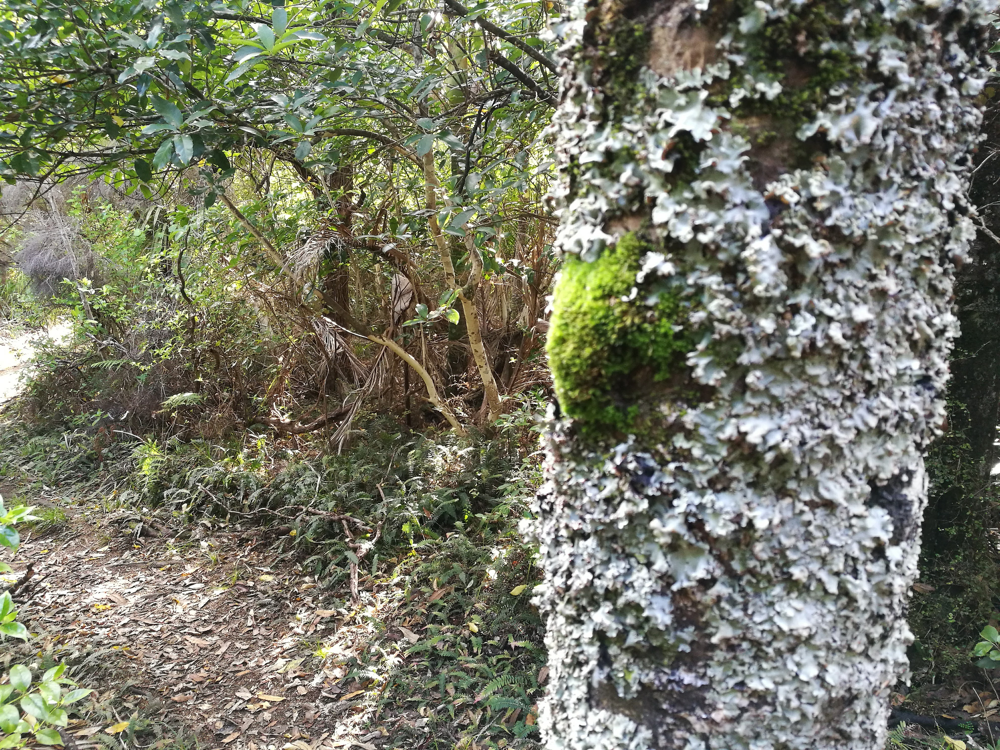
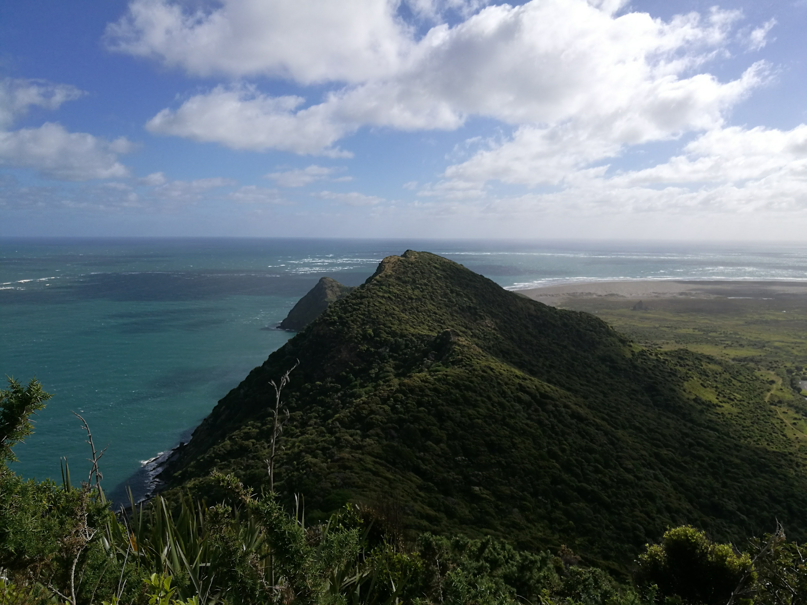

  <meta charset="utf-8">
  <meta name="viewport" content="width=device-width, initial-scale=1">
  <link rel="stylesheet" href="https://maxcdn.bootstrapcdn.com/bootstrap/3.4.1/css/bootstrap.min.css">
  <script src="https://ajax.googleapis.com/ajax/libs/jquery/3.7.1/jquery.min.js"></script>
  <script src="https://maxcdn.bootstrapcdn.com/bootstrap/3.4.1/js/bootstrap.min.js"></script>
  
  <link rel="stylesheet" href="styles.css" />
<br></br>

<div><h3><center>
<p>
Whatipu was supposed to be a gentle walk, we landed up having a serious walk, pulling ourselves up by chains!

There was a beautiful vista though, an amazing view!
</p>
</div></h3></center>


<p>
Use the map below to scroll through the area of whatipu! 

There is a channel between the 2 peices of land, whatipu and the manukau heads which is also very beautiful.

Drag the map around a bit to get a feel.
</p>

<style>

.whatipupics{

display: flex;
flex-direction: column;
justify-content: space-between;

}

.tgc{
position: relative;
bottom:0 px;
}

</style>


```{r echo=FALSE, warning=FALSE, fig.height=5, fig.width=14, cache=TRUE , fig.cap="whatipu map"}
library(leaflet)
library(knitr)

m <- leaflet() %>% addTiles() %>% setView(174.482858, -37.040445, zoom = 13)
m  #  -37.040445, 174.482858


opts_chunk$set(comment="", fig.align="center", tidy=TRUE)
knitr::opts_chunk$set(warning = FALSE, message = FALSE)
```

<p>
Whatipu is part of the waitakere ranges.
</p>


<div class="whatipupics">




















</div>

<br></br>

<div><h3><center>
Taking the photo at the end was quite something as it was very windy that day, and we were both tired.

I crab walked some of the way down!
</div></h3>
</center>

<hr></hr>

<div id="tgc">


[back to tag cloud](https://nicspics.netlify.app/tags/random/)

</div>