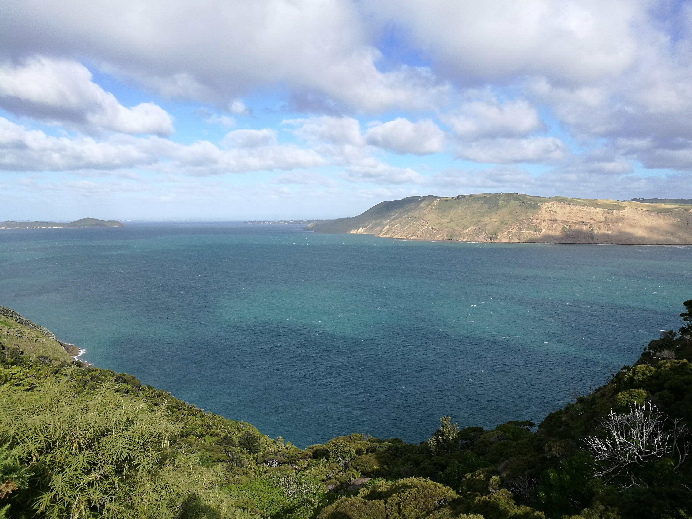
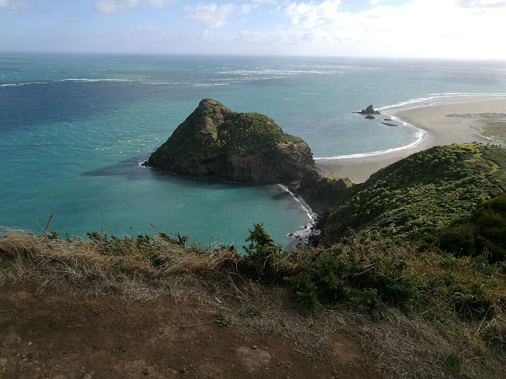

  <meta charset="utf-8">
  <meta name="viewport" content="width=device-width, initial-scale=1">
  <link rel="stylesheet" href="https://maxcdn.bootstrapcdn.com/bootstrap/3.4.1/css/bootstrap.min.css">
  <script src="https://ajax.googleapis.com/ajax/libs/jquery/3.7.1/jquery.min.js"></script>
  <script src="https://maxcdn.bootstrapcdn.com/bootstrap/3.4.1/js/bootstrap.min.js"></script>
  
  <link rel="stylesheet" href="styles.css" />
<br></br>

<p>
Whatipu was supposed to be a gentle walk, we landed up having a serious walk, pulling ourselves up by chains!

There was a beautiful vista though, an amazing view!
</p>


<p><b>
Use the map below to scroll through the area of whatipu! There is a channel between the 2 peices of land, whatipu and the manukau heads which is also very beautiful.

Drag the map around a bit to get a feel.
</p></b>

<style>

.whatipupics{

display: flex;
flex-direction: column;
justify-content: space-between;

}

.tgc{
position: relative;
bottom:0 px;
}

</style>


```{r echo=FALSE, warning=FALSE, fig.height=5, fig.width=14, cache=TRUE , fig.cap="whatipu map"}
library(leaflet)
library(knitr)

m <- leaflet() %>% addTiles() %>% setView(174.482858, -37.040445, zoom = 13)
m  #  -37.040445, 174.482858


opts_chunk$set(comment="", fig.align="center", tidy=TRUE)
knitr::opts_chunk$set(warning = FALSE, message = FALSE)
```

<p>
This is a pretty special place, another island sanctuary for birds. We took a quick ferry ride from downtown Auckland!
</p>
<p>
Further down the page, there are 2 takahe with a new chick. These birds are close to being extinct. There are about 500 to 600 of these birds left!
</p>


<div class="whatipupics">






</div>

<br></br>

<hr></hr>

<div id="tgc">


[back to tag cloud](https://nicspics.netlify.app/tags/random/)

</div>
