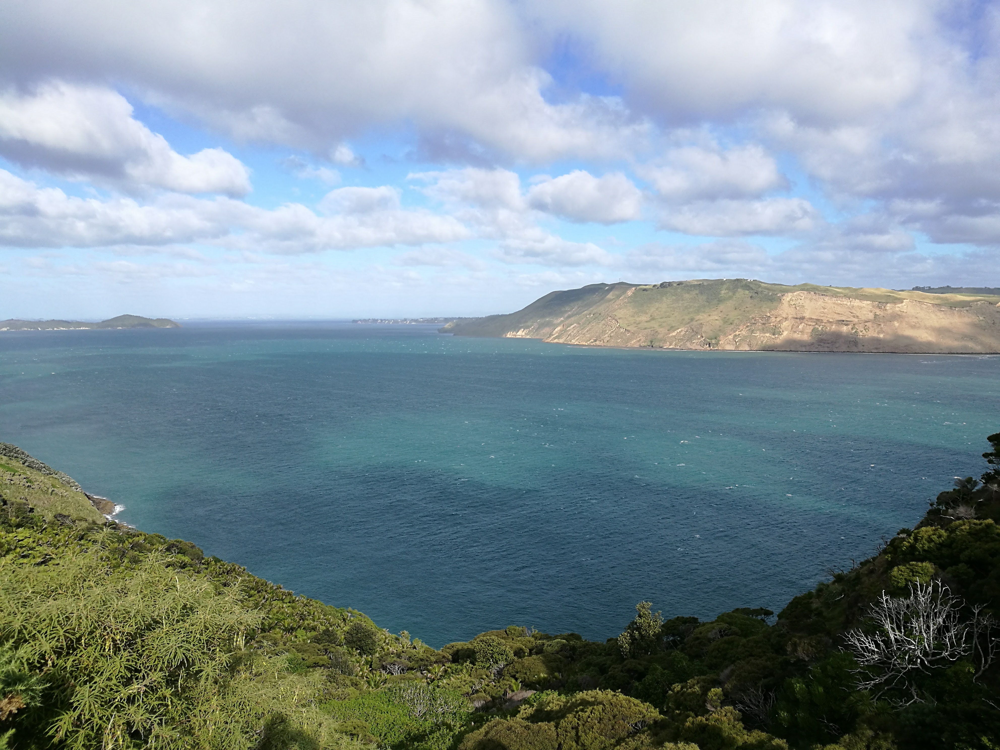
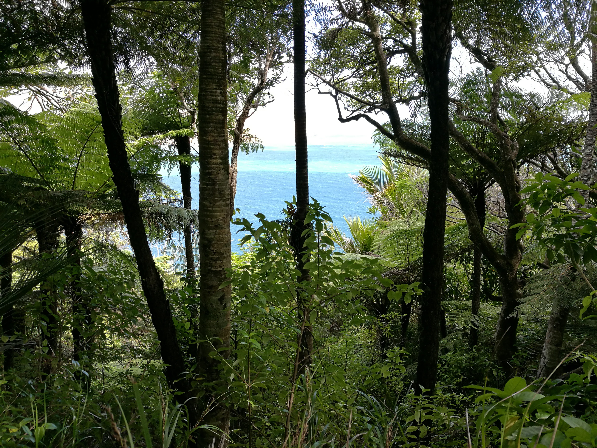
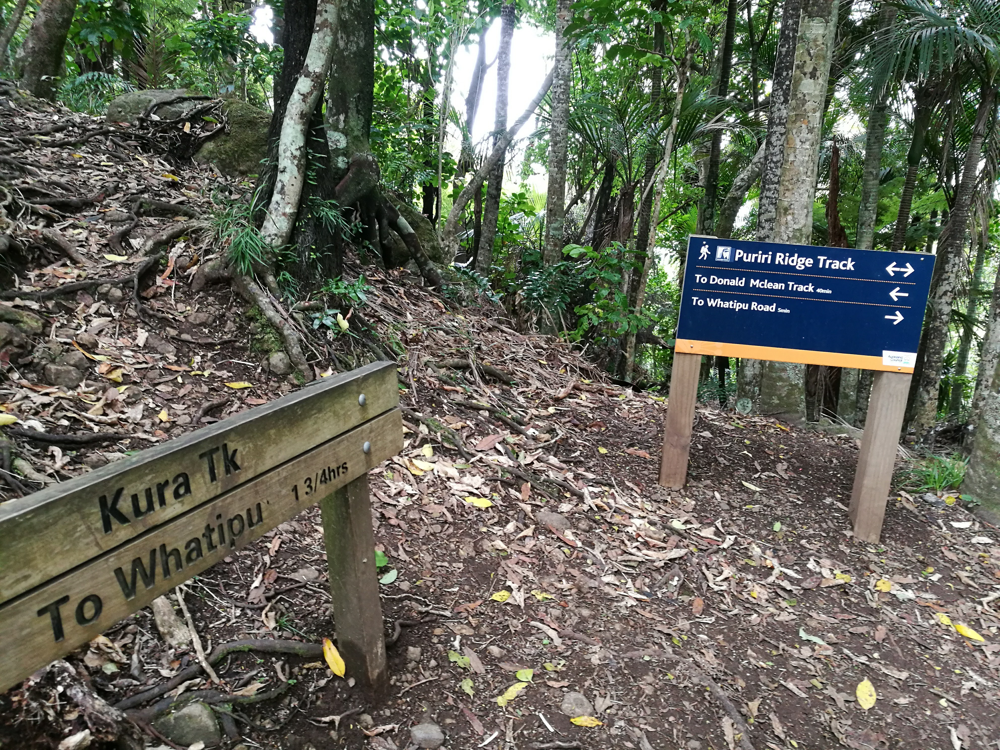
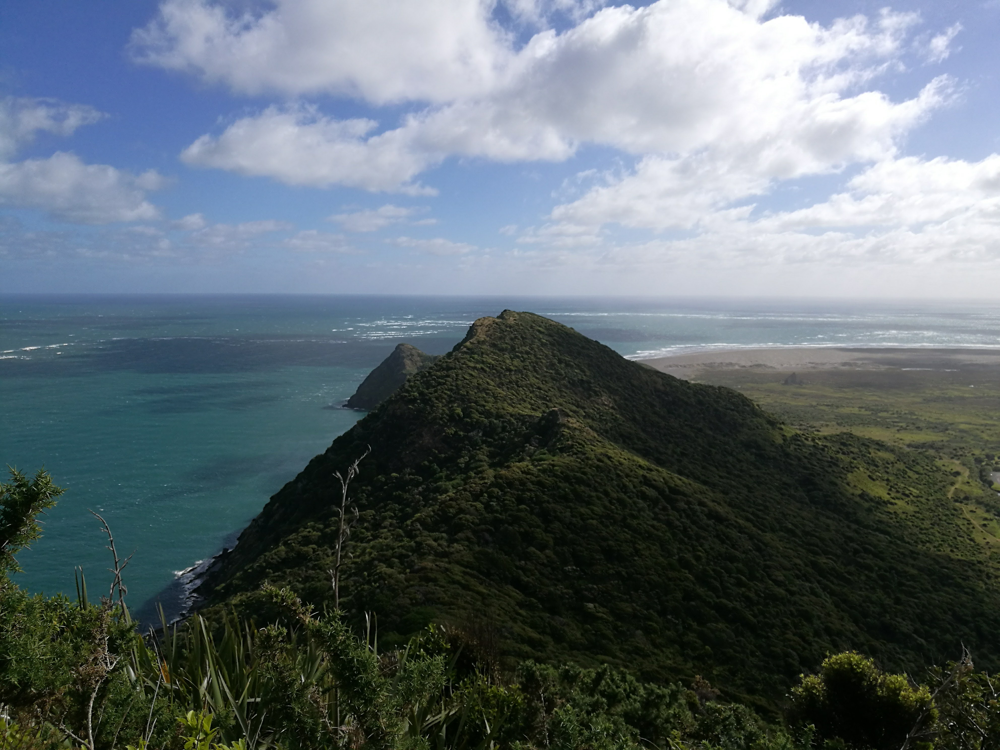

<link href="index_files/htmltools-fill/fill.css" rel="stylesheet" />

<link href="index_files/leaflet/leaflet.css" rel="stylesheet" />

<link href="index_files/leafletfix/leafletfix.css" rel="stylesheet" />

<link href="index_files/rstudio_leaflet/rstudio_leaflet.css" rel="stylesheet" />

<meta charset="utf-8">
<meta name="viewport" content="width=device-width, initial-scale=1">
<link rel="stylesheet" href="https://maxcdn.bootstrapcdn.com/bootstrap/3.4.1/css/bootstrap.min.css">

<link rel="stylesheet" href="styles.css" />
  

<h3>

Whatipu was supposed to be a gentle walk, we landed up having a serious walk, pulling ourselves up by chains!

There was a beautiful vista though, an amazing view!

</h3>

Use the map below to scroll through the area of whatipu!

There is a channel between the 2 peices of land, whatipu and the manukau heads which is also very beautiful.

Drag the map around a bit to get a feel.

Figure 1: whatipu map

Whatipu is part of the waitakere ranges.

  

<h3>

Taking the photo at the end was quite something as it was very windy that day, and we were both tired.

I crab walked some of the way down!

</h3>

[back to tag cloud](https://nicspics.netlify.app/tags/random/)

